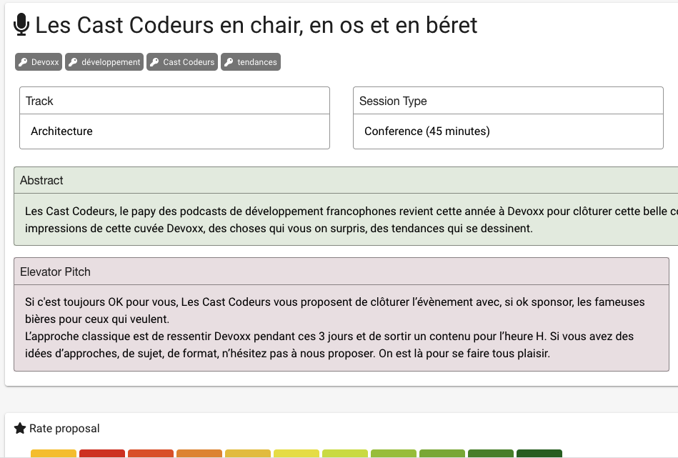
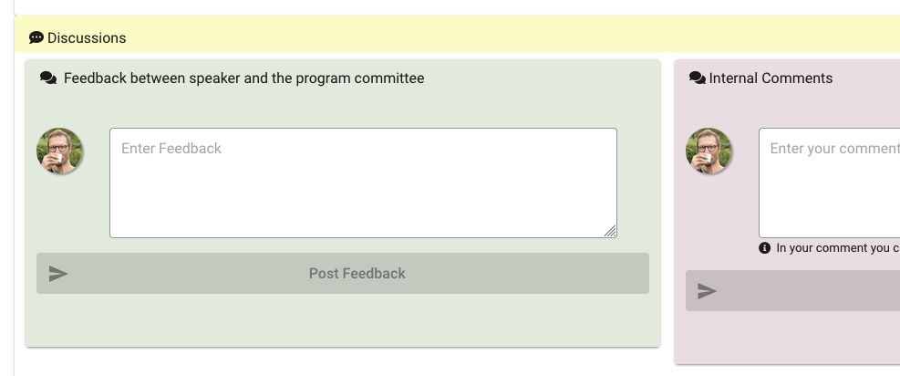

# Userscripts for the Devoxx CfP hosted on cfp.dev

Userscripts for the Devoxx CfP hosted on cfp.dev
* removes the AI summary block
* add colors to select blocks to improve eye navigation

Known to work on <https://devoxxfr2024.cfp.dev> at 2024-01-11

Known to work for Scriptbot (Firefox) and [Userscripts](https://github.com/quoid/userscripts) on Safari for macOS and iOS

## UI screenshots

### Abstract

Bio

### Comments

## How to install

Use your favorite Userscripts extension for your favorite browsers.
For example:

* Stylebot for Firefox (does not allow script auto update)
* [Userscripts](https://github.com/quoid/userscripts) on Safari for macOS and iOS (allows for auto update)

Open <https://raw.githubusercontent.com/emmanuelbernard/devoxx-cfp-userscripts/main/cfp-devoxx.user.css>
and copy the content as a new script in these extensions.
